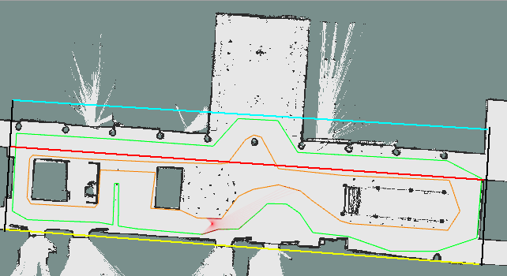

# Path Planning

The system uses two seperate path planners, a local planner and a global planner. As a global path planner, it uses RRT Connect and as a local path planner it uses the usual RRT. You can find the codes for those tasks under svea_starter/src/svea_core/src/svea/planner. Other scripts that they depend on are utils.py and smoothing.py, which you can find in the same dictionary. The script utils.py, provide the path planners the position of the obstacles and if a collision will occur or not when following the genereated path. The script smoothing.py, smoothes the path that is genereted from the path planner. 

## Global Planner - RRT Connect

## Local Planner - RRT

A RRT grows a tree rooted at the starting configuration by using random samples from the search space. The path is planned by building a tree starting from the initial position. As each sample is drawn, a connection is attempted between it and the nearest state in the tree. If the connection is feasible (passes entirely through free space and obeys any constraints), it results in the addition of the new state to the tree. When a point in the space is randomly sampled, it is checked if the point collides with an obstacle in the space. If the sampled point has no collisions, it is then checked if the straight line path between the sampled point and the nearest existing point in the tree has any collisions. If this straight line path has no collisions, the sampled point is added to the tree with the nearest point as its parent node. If there is a collision, this point is thrown out. Each time after a node is added to the tree and the node is less than some threshold distance from the goal position, it is checked if the goal can be reach in a straight line path from the added node. If the goal position is reachable, the goal position is added to the tree with the recently added node as its parent. At this point, the path planning is complete. If the goal position is still unreachable, additional points are sampled. The RRT works according to the following pseudo code:

Algorithm RRT:

```bash
Input: Initial configuration xinit, number of vertices in RRT K, incremental distance dt, Xfree is free space)
Output: RRT graph G

Function: RRT (K, xinit, dt)
  1. G.init(xinit)
  2. For i=0 to K do
  3. xrand <- random_config(Xfree)
  4. Extend(G,xrand)
  5. End for
  6. Return G

Function: Extend (G, xrand)
  1. xnear <- nearest_neighbor(G,xrand)
  2. xnew <- new_state(xnear, dt)
  3. if collision_free_path(xnear,xnew) then
  4. G.add_node(xnew)
  5. G.add_edge(xnear,xnew)
  6. End if
  7. Return G
```


## Modifications

When the path planning is done, it doesn't mean that one can use the path generated by the RRT. There are several modifications which should be done in order to make the generated path fulfill 3 fundamental criteria: Time effeciency, smoothness and collision free path. 

### Sampling Domain

In order to generate the path as fast as possible one should restrict the sampling domain. It means that depending on the location of the car, the RRT algorithms randomly sampled at a specified region instead of sampling anywhere in the space. This means that you are going to speed up the computation time in order to find a feasible path and thereby the time efficiency is achieved. Restricting the sampling domain is done by forcing the sampling between specified lines in the space. These straight lines was calculated by reading the point coordinates in the map and then interpolating straight lines between them, see the figure below.



### Obstacle Avoidance

The most fundamental criteria is that the generated path should be obstacle free. This means that for every iteration in the RRT algorithm one should ensure that the added vertex to the tree is not located at the occupied space. In order to ensure this, the known obstacles in the map was modelled as polygon shaped obstacles. Modeling the obstacle, Q, as a polygon lead to the following representation of the occupied space


Index “m” represent the m:th obstacle, y = (x,y) occupied coordinate in the map, A and b are obstacle matrices for m:th obstacle. This obstacle polygon representation allows us to check if the sampled point from RRT or RRT connect belongs to this set. If this is the case then this point is not going to be add as a vertex to the tree.

### Smoothing

After a path is found, path smoothing can be applied to make a smoother, more direct route to the goal. Assume we already have an optimal path, but we wish to smooth the trajectory. For these equations, y represents a smoothed coordinate at time step i while x represents the original unsmoothed coordinate. The ith element of x refers to a list containing the x and y coordinates of an object at the ith time step


In order to smooth the path we should do some updates based on the gradient ascent algorithm. The first update is based on smoothing the path with respect to the unsmoothed trajectory. 


One can adjust the importance of the smoothing optimization with hyper parameter alpha. The higher the alpha, the more the coordinates should be smoothed, while the opposite will result in coordinates that have a greater adherence to the original unsmoothed set of coordinates. For the second update, we can update the smoothed coordinates in the direction that minimizes the deviation between adjacent smoothed coordinates. Beta acts like alpha in that is adjusts how much emphasis to put on the smoothed coordinate update.


