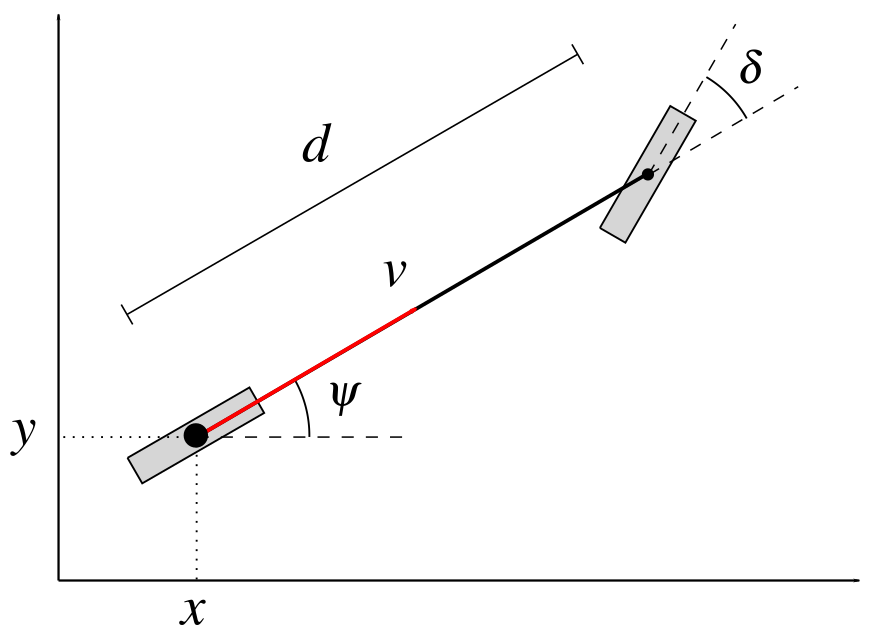
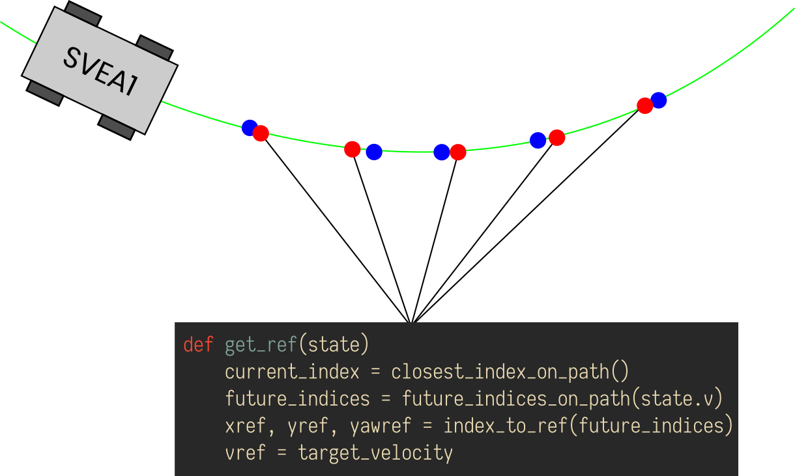

# SVEA Team 1

## A short description
This is a working solution for path following and collision detection and avoidance, for use on the SVEA platform.

## Dependencies
Follow the instructions under __Installing the library__ in `README.md` to install missing ROS dependencies and build the package. However, it is also necessary to install python2 libraries

- `casadi`
- `numpy`
- `matplotlib`
- `scipy`

Do so with a method of your choice

_Note:_ The SVEA computer is of `aarch64` architecture and `casadi` has to be built from source with `ipopt` and `clang` support (for JIT compilation). Please find instructions on the `casadi` webpage.

## How to run the code

Simulations can be run with
```bash
roslaunch svea_core q1_mpc.launch
```

To run the code on the actual SVEA
```bash
roslaunch svea_core q1_real.launch
```


## Flow of code

When the launch file, “q1_mpc.launch”, for simulation is run, some of the important python files and packages that’s loaded are :
  1. q1_mpc_co_av.py : this is the main file which is responsible for setting up and building tge solver for the MPC. 
  2. map_collision_node.py : This file corresponds to the collision detection and check node. This is resposible for starting the new path planning algorithm in case of an obstacle
  3. costmap_2d package : This is the ros package used which the collision node uses to detect the obstacles based on the cost of the same.

## Parameter tuning

There are several parameters that can be tuned. For the costmap, type
```bash
rosed svea_core costmap_params.yaml
```

for the real car or 
```bash
rosed svea_core costmap_params_sim.yaml
```
for the simulation.

For tuning the MPC, type
```bash
rosed svea_core parameters.py
```
## MPC Path follower

We use the the ordinary nonlinear bicycle model defined by the ODE

<!--
\large\displaystyle\begin{align*}\dot{x} &= v \cos \psi \\ \dot{y} &= v \sin \psi \\ \dot{\psi} &= \frac{v}{d} \tan \delta \\ \end{align*}
-->


with the variables and parameters defined as seen in the figure below



The current state of the vehicle, along with references that are dynamically generated at each sampling instance (fig. below), are sent into the MPC which generates a control signal.



## Local Planning
Local planning is started when an obstacle, detected by the mapping routine, intersects the current path plan. The detection system works by translating the current path to a matrix representing the map and with ones wherever the path is and zeros everywhere else. This matrix is then multiplied with the map produced by the mapping, i.e. costmap2d node. If this matrix-multiplication produces any values over a certain threshold a collision is registered and the map (with obstacles, goal and start position) is sent to an A* planner implemented in c++ which produces a new piece of trajectory which is then spliced in to the overall path plan.

## Global Path finder 
Our Svea car loads a global path and picks out reference points used in the race. It is important that the global path is feasible for the car and that it keeps a safe distance to any mapped obstacle. 

### About the RRT Algorithm
The global path finder uses a RRT Algorithm that loads a track or an obstacle list and finds a safe way to a set target point. This RRT Algorithm respects the maximum yaw angle of the car and saves the previous yaw angle in every step. Because of the fact that the RRT algorithm always finds a solution (but in infinite time). Respecting the yaw gives it also always a feasible solution regarding the car. In reservation if the set target points are put in a feasible position with respect to the start point. This is why we chose to not use the A* algorithm that does not guarantee to always find a path. A second reason is that A* works discreetly and we would like to respect the curvatures of the car. Also RRT* was considered easier to implement. Since the RRT algorithm is not guaranteed to give the optimal solution we manipulated the algorithm a bit to ‘’black list’’ nodes that led to a dead end.

### How to run the global path finder
The code contains two important files, one named RRT_Team1.py and the other named GlobalPathfinder.py. GlobalPathfinder.py is the ''main file'' for the path finder, here you run the code to get your path. For this particular code-setup you also need Track.py and a map.pickle file. The first one contains the corner coordinates of the track and the second contains the occupancy map as a pickle file. You run the code through the GlobalPathfinder.py file with the following command  
```bash
rosrun svea_core GlobalPathfinder.py
```
As default is the code loading the given track and some loaded target points along the way. 

### Adjustment of RRT parameters example 
At the beginning of the main code you are about to choose to load the track, the obstacle map or both. In addition there are also parameters that are available for tuning. Those are find by tapping the following command in your python command window

```bash
rosrun svea_core GlobalPathfinder.py --help
```

Upon the typing, a short description is visible. It describes the different tuning parameters. Namely step length, radius of mapped obstacles and distance to goal tolerance. If you decrease the step length a lot will the algorithm take longer computational time and is more likely to get stuck in front of an obstacle. If you instead increase the step length will the computation time decrease but the algorithm are likely to not find any possible solutions since all step ends too close to an obstacle. The radius of the mapped obstacles ensures that the path stays at a safe distance. If the radius is too large the algorithm will not find its path through tight places and if the radius is too small it will give the car a dangerous path too close to walls and obstacles. The last parameter is judging when the algorithm believes that it finds it target point, if you increase this one will the path change direction before it hits the target point along the way. To change a particular parameter one could enter this command,

```bash
rosrun svea_core GlobalPathfinder.py --step_length 30 --step_size 45 
```

### Future improvements 
If more time existed there would be an interest to go through with the discrete solution that would make the global pathfinder faster. With a faster compilation it is more convenient to catch minor errors and to do developments. Further on it would be nice to load the global path finder in the beginning of the whole Svea start up. In the current path finding solution requires to set target points along the way manually, that would be nice to be pointed out somehow automatically.
