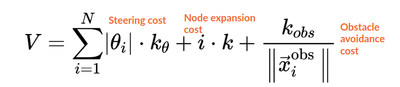

# Team 5 - Source Code [EL2425 HT20-1]
## A short description
This folder contains the code of the Team 5 implementation of the EL2425 task. The task was to write software that enabled a small remotely operated vehicle to avoid unknown obstacles given a map of its surroundings. The vehicle is equipped with a 2D lidar scanner and an IMU sensor. The main features of the implementation were the decision logic (which involved a state machine), obstacle mapping, and A* path planning. 

## **Important to read if code review for Team 5 is to be done!** 

The implementation done by Team 5 can mostly be found under the *[`svea_starter/src/svea_core`](https://github.com/KTH-SML/svea_starter/tree/team5_master/src/svea_core)* directory. Any specifics regarding the implementation can be found there.

Make sure casadi and numpy packages are installed. To install these using pip run:

    > pip install casadi 
and 

    > pip install numpy

# Quick Guide To Start the Simulation
Run one of two options in a terminal: 

    > roslaunch svea_core t5_q1.launch 
    
to start the simulation outside the Q1 lecture hall or 

    > roslaunch svea_core t5_floor2.launch

to run the simulation on floor 2.

# To run the code on the real car
 There are two separate launch files called: `t5_svea.launch`, and `t5_svea_q1.launch`. Setup your hardware and software as instructed in the `svea_starter/README.md` and respective tutorials and run one of these launch files.

## What happens when I run the simulation? 

1. The A* global planner will attempt to find a path through the provided course. 
2. The path follower will start to follow the generated path using a PI controller. 
3. Vehicle will stop at detected obstacles within emergency range and plan around them. 
4. Simulation is finished when vehicle reaches end of the trajectory.

# Main Features

## State Machine to Handle Every Situation 

The decision making logic is handled in a state machine that can be found within the *[scripts directory](https://github.com/KTH-SML/svea_starter/tree/team5_master/src/svea_core/scripts)*. 

The state machine decision logic is visualized by the following figure: 

 

## A* Path Planner

A hybrid A* algorithm is used for path planning both globally and around encountered obstacles. 

Notable things about the implementation: 
* The hybrid A* uses the Euclidean distance to the goal coordinate as a heuristic when choosing which node to expand further. 
* Expand the nodes wrt. current pose. 
* The cost function is given by the following equation

 

Where N is the number of segments the road has. This cost function penalizes big steering angles to avoid sharp turns, it penalizes longer paths, and it penalizes vicinity to obstacles, which results in paths more likely to be generated in the middle of corridors.  

Notable steps that the algorithm goes through to generate a path are.
1. Create points between polygon vertices that A* uses as obstacles 
2. Grid the solution space based on the coordinates of the obstacles
3. Cap the number of nodes expanded such that the search does not go on for too long 

In other ways than above mentioned the implementation follows the A* algorithm structure. For more information see a more detailed description on *[A* specifically](https://en.wikipedia.org/wiki/A*_search_algorithm)*. The algorithm implementation can be studied in the astar.py script available *[in this directory](https://github.com/KTH-SML/svea_starter/tree/team5_master/src/svea_core/src/svea/path_planners/astar.py)*. 

In order to test the A* planner to see how the global planner will plan the path around the track run:

    > python src/svea/path_planners/astar.py

This command will calculate a path and plot something like this:

 

To change the settings of the planner, edit the dictionary in the same script.

Some of the parameters in `astar.py` that can be changed are:
- Grid resolution
- Planning distance 
- Q1 or Floor2 boolean

## Lidar Obstacle Mapping 

Obstacle mapping only occurs after discovering an obstacle within the emergency range. After emergency stop is activated, the car stops and maps its surroundings with the help from a lidar. Only obstacles within a certain distance and angle range. The obstacle mapper inflates the lidar points to a square with the same side length as the width of the car. The squares are inflated so that they are positioned at the same angle as the car is facing during the mapping. The solution can be studied in pure_pursuit.py script *[in this directory](https://github.com/KTH-SML/svea_starter/blob/team5_master/src/svea_core/src/svea/controllers/pure_pursuit.py)* under the lidar_mapping function.

 	

## PID Path Follower

A simple PID path follower is used to control the vehicle in terms of actuated speed, and steering angle. The controller that is used is the original path follower from `controllers/pure_pursuit.py`, with adjustments on P, I gains, and anti-windup. The path follower can be studied in pure_pursit.py script in *[this directory](https://github.com/KTH-SML/svea_starter/tree/team5_master/src/svea_core/src/svea/controllers)*. 

## MPC Implementation
The code can also be used having MPC as the emergency replanner. This setting can be toggled in each launch file, but is is by default set to `False`. Note: for the MPC to work on the car, the computer on the car needs to have all the CASADI-dependencies including the optimization solver IPOPT installed. 

