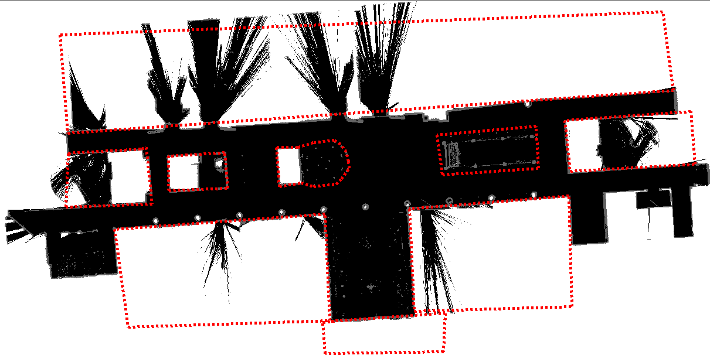
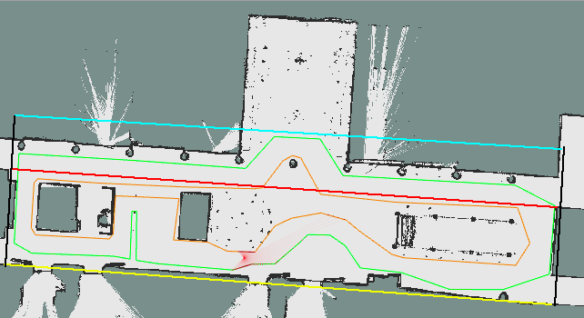

# EL2425 TEAM2

## System Requirements

The system reuiqres the packages scipy, tqdm, matplotlib and numpy. To install them, run the following commands on the terminal:

```bash
pip install scipy
pip install tqdm
pip install matplotlib
pip install numpy
```

## Run System in Simulation

To run the system in simulation, open a terminal and type the following command:

```bash
roslaunch svea_core floor2.launch
```

Rviz should open and you should see the map. Use 2D pose estimate to initialize the car's position (approximately (0, 0)). The global planning should start and yield a path. If the path has been genereted and is shown on rviz, the car should start following the path. While the system runs, keep an eye on the terminal to check if the car replans and do not find a path. If the car does not find a path, restart the program. You terminate the program with ctrl + c.

## Run System in Reality

To run the system in reality, you have to modify the launch file /svea_starter/src/svea_core/launch/floor2.launch in the car. Set is_sim to False and comment the line <node pkg="map_server" type="map_server" name="map_server" output="screen" args="$(arg map_file)" />. Add the following lines to your launch file:

```bash
<!--open serial connection for controlling SVEA-->
<node pkg="rosserial_python" type="serial_node.py" name="serial_node">
<param name="port" value="/dev/ttyACM0"/>
<param name="baud" value="250000"/>
</node>

<include file="$(find svea_sensors)/launch/localize.launch">
    <arg name="use_rs" value="true"/>
    <arg name="file_name" value="$(arg map_file)"/>
</include>
```

When the launch file has been modified, the program is ready to run. However, when running the program in the car for the first time you need to go to /svea_starter/src/svea_sensors in the terminal and run the following command:

```bash
sudo bash grant_hardware_permisions.sh
```

When the step above is done, you can proceed as usual. Connect to the car by open a terminal and type:

```bash
ssh nvidia@svea2.local
```

where svea2.local is the IP-adress of the car. A password will be required, type nvidia. Then run the following command:

```bash
roslaunch svea_core floor2.launch
```

You also need to open another terminal and go to /svea_starter/src/svea_core/resources/rviz. Run the command:

```bash
rviz -d SVEA_floor2.rviz
```

As in the simulation, rviz should open and you should see the map. Use 2D pose estimate to initialize the car's position (approximately (0, 0)). The global planning should start and yield a path. If the path has been genereted and is shown on rviz, the car should start following the path. While the system runs, keep an eye on the terminal to check if the car replans and do not find a path. If the car does not find a path, restart the program. You terminate the program with ctrl + c.

## System Description

When the program has been launched from the terminal, it starts to initialize some processes and then waits for the user to initilize the car's position with 2d pose estimate. Thereafter, the global planner starts to find a path from the start to the goal poisiton. When the path has been genereted, the system starts to go into a loop where it first always checks if it has reached the goal or not. If it has not reached the goal, then it computes the desired control signals (genereted from path tracker) to track the path. While doing so, it simultaneously scans the environment with a LIDAR sensor and updates the map with the LIDAR data. The LIDAR data consists of distances from the car to the obstacles that the LIDAR has detected for each beam (135 beams in total). After updating the map, the system runs the replanning algorithm. It executes all the mentioned steps above in one time step, in order to repeat them, where it starts by checking if it has reached the goal or not. When the car has reached the goal, it sets the speed to zero and waits for the user to terminate the program.

The code for main system can be found in /svea_starter/src/svea_core/scripts/core_examples/floor2_examples.py. For a further description of the subsystems such as path planning or path tracking, see the sections below.

# Map Representation

The system uses two sorts of maps for obstacle avoidance. For known obstacles, it uses a map that represents obstacles as convex sets, while for unknown obstacles it uses an occupancy grid. 

## Convex Set Representation

As mentioned above, this map is used to represent known obstacles as convex sets and need to be defined before running the program. To create the known obstacles, a GUI was provided on a given map. To run the GUI, one need to install some dependencies first: 

```bash
sudo apt install python-imaging-tk python3-tk
pip3 install numpy pillow
```

Then, the GUI can be excuted with the following commands:

```bash
roscd svea_core/scripts/util
python3 obstacles_builder_gui.py
```

Once you have run the GUI, a blank window with some buttons should appear. You should press the button "Load map" and choose a pickle file that represents your map. Once the map has been loaded, you can start adding obstacles with the button "Add new obstacle". 

For our specific map, we form our known obstacles as convex sets, see the figure below as an example.

 

When the map is done, you should export and save it. A yaml file will be genereted, which consists of lists of vertices for each obstacle in the map. These lists are stored in the variable occupancy_grid.obstacles in the main file floor2_example.py. This variable is then used in the obstacle avoidance for the path planners, more specifically in the code utils.py, which can be found in /svea_starter/src/svea_core/src/svea/planner. There, with the help of the function _compute_convex_hull_equations, it converts every list of vertices to a condition


that describes the limits for x and y within that obstacle that is formed by the vertices. These limits are then used for the path planners to check if they collide with a known obstacle or not, see the section Path Planning for further description. 

## Occupancy Grid Representation

For the unknown obstacles in the map, the system uses an occupancy grid representation. The dimensions of the occupancy grid is 1270x568 with a resolution of 0.05 m. The origin is (-30.55, -11.4), which is being mapped as grid (0, 0) in the occupancy grid. The grids are initialized with 0. If they become occupied, then their values updates to 100.

### Update Map 

The algorithm that updates the occupancy grid, takes a list of obstacle coordinates from which the LIDAR has detected as input. How the LIDAR data is converted to obstacle coordinates, can be found in the section Main Node. Apart from this list, the algortihms also take the distances from the car to the detected obstacles for each LIDAR beam and their corresponding angles togheter with the car's state. Note that the update of the occupancy grid takes place every time step.

Two grids represented as matrices are used, logodds, which is grid with logarithmic probabilities in each node, and localmap, which is a usual occupancy grid with values of either 0 (free) or 100 (occupied). The probabilites in the logodds map, state the probability of a node being occupied. If a node in the logodds exceeds a certain probability or threshold, then the corresponding node in the localmap is set to 100 (occupied). Both these matrcies are initialized with 0 values.

Once the function has everything it needs, it starts by converting the obstacles' coordinates and car's position to indeces in the occupancy grid. Then for each LIDAR beam that has detected an obstacle, a list of indeces that the beam has traversed is being returned from the Bresenham's algorithm. For all the indeces that the beam has traversed, except the last one, are treated as free nodes, who's values are updated with pfree (logarithmic probability of being free) in the logodds map. The last node, is treated as an occupied grid, which is being updated with pocc (logarithmic probability of being occupied). As mentioned above, if a node's value exceeds a certain probability or threshold, the coressponding node in the occupancy grid is set to 100.

The alghorithm can be summarized in the following procedure:

```bash
1. Convert the obstacle coordinates and car's position to indeces
2. For every LIDAR beam:
  3. Calculate the beam's traversed nodes
  4. For every traversed node:
    5. If not last node:
      6. logodds(node) = logodds(node) + pfree
    7. Else:
      8. logodds(node) = logodds(node) + pocc
    9. If logodds(node) > threshold:
      10. localmap(node) = 100
``` 

You can find the code for occupancy grid in /svea_starter/src/svea_core/src/svea/map/occupancy_grid.py. Note that you need to install tqdm.

# Path Planning

The system uses two seperate path planners, a local planner and a global planner. As a global path planner, it uses RRT Connect and as a local path planner it uses the usual RRT. You can find the codes for those tasks under svea_starter/src/svea_core/src/svea/planner. Other scripts that they depend on are utils.py and smoothing.py, which you can find in the same dictionary. The script utils.py, provide the path planners the position of the obstacles and if a collision will occur or not when following the genereated path. The script smoothing.py, smoothes the path that is genereted from the path planner. 

## Local Planner - RRT

The RRT connect is a special and more efficient version of basic RRT. The basis of RRT connect comes from ordinary RRT, so it makes more sense to start introducing RRT.

A RRT grows a tree rooted at the starting configuration by using random samples from the search space. The path is planned by building a tree starting from the initial position. As each sample is drawn, a connection is attempted between it and the nearest state in the tree. If the connection is feasible (passes entirely through free space and obeys any constraints), it results in the addition of the new state to the tree. When a point in the space is randomly sampled, it is checked if the point collides with an obstacle in the space. If the sampled point has no collisions, it is then checked if the straight line path between the sampled point and the nearest existing point in the tree has any collisions. If this straight line path has no collisions, the sampled point is added to the tree with the nearest point as its parent node. If there is a collision, this point is thrown out. Each time after a node is added to the tree and the node is less than some threshold distance from the goal position, it is checked if the goal can be reach in a straight line path from the added node. If the goal position is reachable, the goal position is added to the tree with the recently added node as its parent. At this point, the path planning is complete. If the goal position is still unreachable, additional points are sampled. The RRT works according to the following pseudo code:

Algorithm RRT:

```bash
Input: Initial configuration xinit, number of vertices in RRT K, incremental distance dt, Xfree is free space)
Output: RRT graph G

Function: RRT (K, xinit, dt)
  1. G.init(xinit)
  2. For i=0 to K do
  3. xrand <- random_config(Xfree)
  4. Extend(G,xrand)
  5. End for
  6. Return G

Function: Extend (G, xrand)
  1. xnear <- nearest_neighbor(G,xrand)
  2. xnew <- new_state(xnear, dt)
  3. if collision_free_path(xnear,xnew) then
  4. G.add_node(xnew)
  5. G.add_edge(xnear,xnew)
  6. End if
  7. Return G
```

## Global Planner - RRT Connect

The RRT connect works exactly same as RRT but in bidirectional manner. The method works by incrementally building two Rapidly-exploring Random Trees (RRTs) rooted at the start and the goal configurations. The trees explore space around them and also advance toward each other. Two trees,  (tree from initial state) and (tree from goal state) are maintained at all times until they become connected and a solution is found. The RRT connect works according to the following pseudo code:

```bash
Function: RRT_CONNECT(q_init, q_goal):
  1. T_a.init(q_init); T_b.init(q_goal)
  2. for k = 1 to K do:
    3. q_rand <- RANDOMCONFIG();
    4. if not (EXTEND(T_a, q_rand) = Trapped) then
      5. if(CONNECT(T_b,q_new) = Reached) then
        6. Return PATH(T_a, T_b)
    7. SWAP(T_a, T_b)
  8. Return Failure

Function: CONNECT(T, q):
1. repeat:
  2. S <- EXTEND(T, q)
3. until not (S=Advanced)
4. Return S
```
The function EXTEND is the same one as in the usual RRT. Here, T represents a tree object and q is a node in the tree. 

## Modifications

When the path planning is done, it doesn't mean that one can use the path generated by the RRT. There are several modifications which should be done in order to make the generated path fulfill 3 fundamental criteria: Time effeciency, smoothness and collision free path. 

### Sampling Domain

In order to generate the path as fast as possible one should restrict the sampling domain. It means that depending on the location of the car, the RRT algorithms randomly sampled at a specified region instead of sampling anywhere in the space. This means that you are going to speed up the computation time in order to find a feasible path and thereby the time efficiency is achieved. Restricting the sampling domain is done by forcing the sampling between specified lines in the space. These straight lines was calculated by reading the point coordinates in the map and then interpolating straight lines between them, see the figure below.



### Obstacle Avoidance

The most fundamental criteria is that the generated path should be obstacle free. This means that for every iteration in the RRT algorithm one should ensure that the added vertex to the tree is not located at the occupied space. In order to ensure this, the known obstacles in the map was modelled as polygon shaped obstacles. Modeling the obstacle, Q, as a polygon lead to the following representation of the occupied space


Index “m” represent the m:th obstacle, y = (x,y) occupied coordinate in the map, A and b are obstacle matrices for m:th obstacle. This obstacle polygon representation allows us to check if the sampled point from RRT or RRT connect belongs to this set. If this is the case then this point is not going to be add as a vertex to the tree.

### Smoothing

After a path is found, path smoothing can be applied to make a smoother, more direct route to the goal. Assume we already have an optimal path, but we wish to smooth the trajectory. For these equations, y represents a smoothed coordinate at time step i while x represents the original unsmoothed coordinate. The ith element of x refers to a list containing the x and y coordinates of an object at the ith time step

Unsmoothed path: 
Smoothed path: 

In order to smooth the path we should do some updates based on the gradient ascent algorithm. The first update is based on smoothing the path with respect to the unsmoothed trajectory. 


One can adjust the importance of the smoothing optimization with hyper parameter alpha. The higher the alpha, the more the coordinates should be smoothed, while the opposite will result in coordinates that have a greater adherence to the original unsmoothed set of coordinates. For the second update, we can update the smoothed coordinates in the direction that minimizes the deviation between adjacent smoothed coordinates. Beta acts like alpha in that is adjusts how much emphasis to put on the smoothed coordinate update.

 
  
# Path Tracker

The path tracker generetes two control signals to follow the desired path. One control signal for the seering angle and one for the velocity are genereted. The steering angle is computed with Pure Pursuit and the velocity command is computed with PID controller, see the subsections below. The code for the path tracker can be found in /svea_starter/src/svea_core/src/svea/controllers/pure_pursuit.py. 

## Steering Controller

Pure Pursuit is used to compute the steering angle. It does so, by continuously looking where the car is at its planned trajectory (which consists of a set of target points) and computes a steering angle towards a target point ahead. How far in the trajectory it will look to compute the steering angle, can be tuned by the variable look- ahead distance Lfc and look forward gain k. 

## Velocity Controller

To compute the velocity command u, a PID controller is used:


where K_p, K_i and K_d are the proportional, integral and derivative gains. The variable e is the error between the target velocity and the actual velocity of the car at time t. The sum e_sum, represents the discrete form of the integral of the error up to time t, which can be represented as a discrete sum of the erros up to time t:


The variable dedt, represents the derivative of the error in time t, which is calculated with backward differention:

 

### Switching Target Velocity

To follow the path more accurately, especially in curves, the controller switches target velocities depending if the car drives on a straight path or a curve. The controller calculates the angle between the car's yaw and the target position two steps ahead. If the angle exceeds a certain threshold, then the system assumess that a curve will appear and switches to a lower target velocity. 

### Saturation

The controller also uses saturation for the control signal u. This is to make sure that the signal does not exceed a certain limit, which can cause too large overshoot of the car's velocity.

# Replanning

For replanning, the car simultaneously checks the LIDAR distances for angles -2, 0 and +2 degrees as it follows the planned path. If the distance for -2 or +2 degree is less than 3m or if the distance for 0 degree is less than 5m, then the car checks if it's trajectory will collide with an obstacle. To do that, it checks if its path between its second and third target will traverse an obstacle. It does this, by indexing the path between the second and third target and checks if the corresponding indeces are occupied or not in the occupancy grid. It also looks at the neighbouring indeces to make sure that it has some margin from the unknown obstacles. However, to reduce the sensitivy of the replanning algorithm, a threshold is introduced. If the system realize that it must replan 3 timesteps repeatedly, then it acutally starts to replan. Then it stops and use RRT (which has information of the updated map) to replan 7 (if possible) or 5 targets ahead. The procedure for the replanning can be found in the main file /svea_starter/src/svea_core/scripts/core_examples/floor2_example.py.

 
