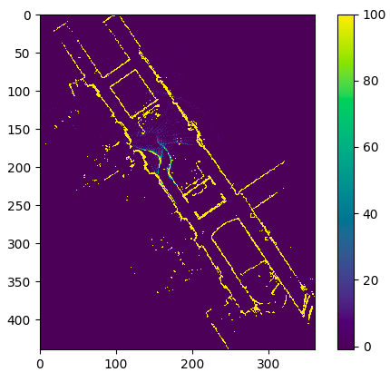
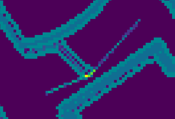

# Description
This repository contains Team 3's implementation of the project task in the Automatic Control Project Course (EL2425). The developed algorithm was tested and implemented on the provided SVEA platform. 

The code is based around different nodes that handle different tasks, which was done to allow for a highly modular system. Key functions in the implemenation are the A*-algorithm which is used in the path planner and Map logic which provides an occupancy grid (inflated and rescaled) for the path planner. To follow the reference path provided by the path planner, a PID controller was used.

# How to run
The implementation is based on a small number of libraries, which can be considered as core libraries to be able to use the SVEA platform. These libraries are
    
    numpy
    math
    rospy
    matplotlib
    
There are two options to run the code for both the "floor2" and the "q1 floor" map, depending on simulation mode or real car mode. 

To run the code in simulation mode for "floor2", run:

    > roslaunch svea_core floor2.launch
        
To run the code in simulation mode for "q1 floor", run:    
    
    > roslaunch svea_core q1.launch
    
To run the code on the real car for map X, simply run X_real.launch e.g.,
      
    > roslaunch svea_core q1_real.launch

# Purpose
The purpose of this document is to give insight into how the different nodes of our SVEA implementation are supposed to interact with each other. It also gives explanations for what the purpose of the nodes are.

# Nodes
The different nodes to be implemented are the following:
- Svea
- Emergency
- Speed and Steering (Controller)
- Control Filter
- Path planner:
  - Trajectory
  - Obstacle avoidance
- Obstacle detection
- Map server
- Map logic
- A star

Node structure could be represented by the following figure:

# Vocab
State representation is the coordinate system that the car sees and uses.

Pixel representation is the coordinate system that the map is given in. Each pixel is one step.

Scaled pixel representation is the coordinate system that is a scaled down version of the pixel representation. The origin is still at the same place as the pixel representation, as it is different compared to the state representation.

## 1. SVEA

#### Subscribers
|Name|Type|Data|Description|
|---|---|---|---|
|Control|control_msg|Not Specified|Look up how it should be specified|

#### Publishers

|Name|Type|Data|Description|
|---|---|---|---|
|State|Vehicle_State|x, y, v, yaw|Coordinates in Vehicle_State System|
|Scan|Laser_Scan|Many|Distances in Vehicle_State coordinates|

#### Parameters

Add parameters if it has any.

#### Purpose
This is the given node in the beginning that signifies the car.

## 2. Emergency

#### Subscribers
|Name|Type|Data|Description|
|---|---|---|---|
|State|Vehicle_State|x, y, v, yaw|Coordinates in Vehicle_State System|
|Scan|Laser_Scan|Many|Distances in Vehicle_State coordinates|

#### Publishers
|Name|Type|Data|Description|
|---|---|---|---|
|emergency_break|boolean|boolean|Describes if the emergency break is on or off|

#### Parameters
|Name|Type|Data|Description|
|---|---|---|---|
|Stop_distance|Float|d|Distance at which the emergency break should enable|

#### Purpose
The purpose of this node is to stop the car if it gets too close to an object to protect it in case of accidents. Perhaps it could be added that instead of stopping, it should try to avoid the obstacle through steering.

## 3. Speed and Steering

#### Subscribers
|Name|Type|Data|Description|
|---|---|---|---|
|state|Vehicle_State|x, y, v, yaw|Coordinates in Vehicle_State System|
|Trajectory|Trajectory_Path|int8[x,y]|Sequence of coordinates for the trajectory. Given in scaled pixel representation|
|using_astar|Bool|Bool|Information if the car is using the astar trajectory or not|

#### Publishers
|Name|Type|Data|Description|
|---|---|---|---|
|Control|control_msg|float32 speed, float32 steering|speed and steering input from the controller|

#### Parameters
|Name|Type|Data|Description|
|---|---|---|---|
|target_velocity|Float|Float|The target velocity while following the base line controller|
|PID_params|Float|Float|The parameters for the PID controller|
|k|Float|Float|Param for lookahead distance for steering|

#### Purpose
The purpose of this node is to calculate the appropriate speed and steering so that the car follows the trajectory fast and precise.

## 4. Control Filter

#### Subscribers
|Name|Type|Data|Description|
|---|---|---|---|
|Control|control_msg|float32 speed, float32 steering|speed and steering input from the controller|
|emergency_break|boolean|boolean|Describes if the emergency break is on or off|

#### Publishers
|Name|Type|Data|Description|
|---|---|---|---|
|Control|control_msg|float32 speed, float32 steering|speed and steering input from the controller|

#### Parameters
N/A

#### Purpose
Control filter that only lets through the control signal if emergency break is not enabled.
If emergency break is enabled the car will reverse
It will also go at a slower pace if the slow_down flag is raised. In the current implementation that means stopping.

## 5. Path planner

#### Subscribers
|Name|Type|Data|Description|
|---|---|---|---|
|Occupancy_grid|Occupancy_grid|int[], dimensions|Occupancy grid describing where the obstacles are. Given in scaled pixel representation|

#### Publishers
|Name|Type|Data|Description|
|---|---|---|---|
|Trajectory|Trajectory_Path|int8[x,y]|Sequence of coordinates for the trajectory. Given in scaled pixel representation|

#### Parameters
- xs: Predifined x-coordinates for main trajectory.
- ys: Predifined y-coordinates for main trajectory.
- look_ahead: Defines how far away from car the trajectory should be estimated by A star
- threshold_distance: Defines maximum distance between car and detected obstacle for A star to be activated
- threshold_wait: Defines distance that car should acomplish before A star could be reinitialized. It helps to avoid unnecessary calculations while detecting hidden obstacles. There a hidden obstacle is an obstacle that is hidden behind an allready detected obstacle. 
- path_end_distance: Defines maximum distance from car to last trajectory point. Trajectory will be updated when distance between car and last trajectory point is less then path_end_distance.

#### Purpose
Purpose is to calculate the path for which the car is supposed to drive along.

## 6. Obstacle detection

#### Subscribers
|Name|Type|Data|Description|
|---|---|---|---|
|State|Vehicle_State|x, y, v, yaw|Coordinates in Vehicle_State System|
|Scan|Laser_Scan|Many|Distances in Vehicle_State coordinates|
|Map|map|Many|Occupancy grid of original map. Given in pixel representation|

#### Publishers
|Name|Type|Data|Description|
|---|---|---|---|
|State|list of coordinate_messages|int8[x,y]|Coordinates where the car has seen obstacles. Given in pixel representation|

#### Parameters
|Name|Type|Data|Description|
|---|---|---|---|
|Scans_per_Rotation|Integer|number_of_rotations_per_scan|How many scans does the Lidar detect, simulation is 135 and real car is 1081|

#### Purpose
Transforms the Lidar readings into coordinates of the real world in order to place them correctly in the occupancy grid.

## 7. Map server

#### Subscribers
N/A
#### Publishers
|Name|Type|Data|Description|
|---|---|---|---|
|Map|map|many|Occupancy grid of original map. Given in pixel representation|

#### Parameters
N/A
#### Purpose
Provides the original static map. Given from the beginning.

## 8. Map logic

#### Subscribers
|Name|Type|Data|Description|
|---|---|---|---|
|Map|OccupancyGrid|many|Occupancy grid of original map. Given in pixel representation|
|pixel_coordinates|map_pixel_coordinates|int8[x,y]|Coordinates where the car has seen obstacles. Given in pixel representation|
|Track|||Coordinates where the tracks inside and outside boundaries are|

#### Publishers
|Name|Type|Data|Description|
|---|---|---|---|
|inflated_map|Occupancy_grid|int[], dimensions|Occupancy grid with static map, track and obstacles (all inflated). Given in scaled pixel representation|

#### Parameters

- number_of_lidar_scans_until_publish: determines how many lidar scans should be included in each map instance. Higher values increase the detected objects corresponding pixels values (trust that there truly is an obstacle there) but can be set to 1 if no noise.

- length_of_memory_list: how many map instances to store. This value in essence means that you will remember length_of_memory_list*number_of_lidar_scans_until_publish rotations from the lidar scan. Set to 1 if no noise.

- occupied_space_threshold: the lowest value for what gets rated as a certain obstacle in the obstacle map depending on how many times a point was detected by the Lidar(made up of all the map instances). 0 to 9 means all readings from the scan will be used as the confidence gets updated with 10 as incremental steps. 0-9 should be used if number_of_lidar_scans_until_publish = 1

- car_radius_in_meters: the radious of the car in meters, can be changed to higher values to give more clerence for when driving around obstacles and from wals

- inflation_for_static_map: how much the static wals should be inflated. As the cars lidar detects the nerby wals as well they will be inflated by car_radius_in_meters close to the car but this inflation helps when planing routs around courners for example.

- rescaling_factor: can be set to any integer and rescales  the whole map by that factor. High values here are benefitial as it means A-star will be able to compute faster for example but it also means the precison of the optimal path becomes less.

#### Purpose
Purpose is to provide a proper occupancy grid used for pathfinding

Following figure illustrates the envirenment as it seen by the car:

## 9. A star

#### Subscribers
|Name|Type|Data|Description|
|---|---|---|---|
| Start point | PathEstimator | int[] | Start point coordinates in pixel format|
| Target point | PathEstimator | int[] | Target point coordinates in pixel format|
| Occupancy grid | PathEstimator | int[] | Occupancy grid reshaped to a 1xn dimensional array|
| Grid width | PathEstimator | int | Width of occupancy grid|
| Grid height | PathEstimator | int | Height of occupancy grid|

#### Publishers

|Name|Type|Data|Description|
|---|---|---|---|
| Estimated path | int[] | int[] | Path calculated by A star|

#### Parameters

- timeout_time: Defines the time limit that makes A star to restart when timeout occures. When timeout is reached the A* will be restarted resulting in more robust path finding.

#### Purpose
This is the path finding algorithm that finds a suitable trajectory with given occupancy grid, start and target point

Following figures illustrate how the A* path finding algorithm works before and after path smoothing is applied:

