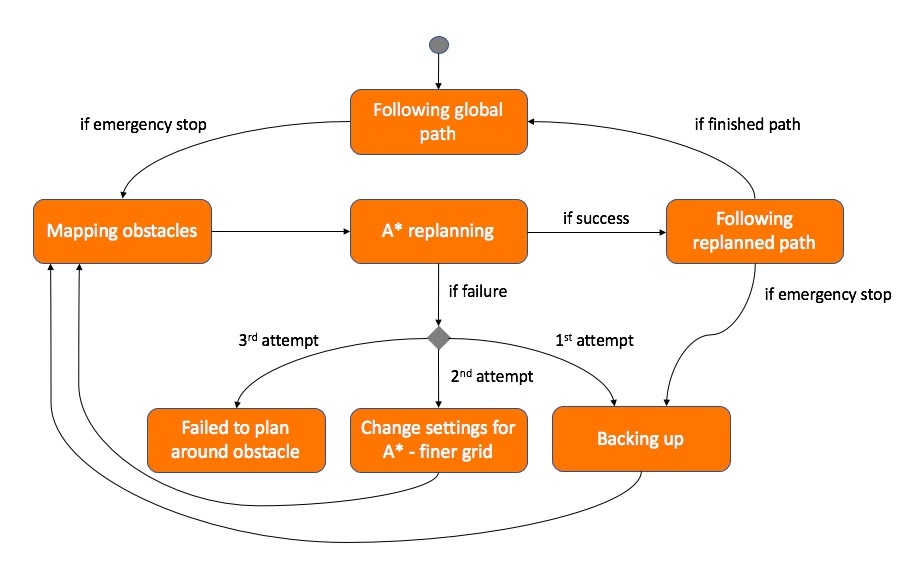
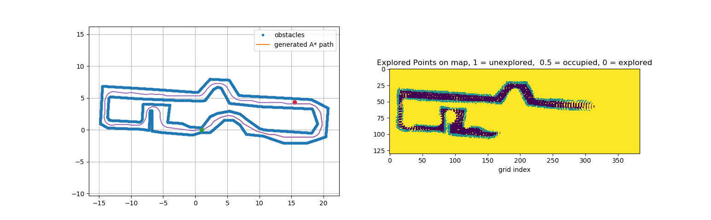

# Team 5 - Source Code [EL2425 HT20-1]

## A short description
This folder contains the code of the Team 5 implementation of the EL2425 task.

# To Start the Simulation
Run one of two options: 

    > roslaunch svea_core t5_q1.launch 
    
to start the simulation outside the Q1 lecture hall or 

    > roslaunch svea_core t5_floor2.launch

to run the simulation on floor 2.

## What happens when I run the simulation? 

1. The A* global planner will attempt to find a path through the provided course 
2. The path follower will start to follow the generated path using a PI controller 
3. Vehicle will plan stop at detected obstacles within emergency range and plan around them 
4. Simulation is finished when vehicle reaches end of the trajectory.

# Main Features

## State Machine to Handle Every Occasion 

The decision making logic is handled in a state machine that can be found within the *[scripts directory](https://github.com/KTH-SML/svea_starter/tree/team5_master/src/svea_core/scripts)*. 

The state machine decision logic is visualized by the following figure:

 

## A* Path Planner

The algorithm used for path planning both globally and around encountered obstacles was a hybrid A*. The algorithm implementation can be found in the *[path planner directory](https://github.com/KTH-SML/svea_starter/tree/team5_master/src/svea_core/src/svea/path_planners)*. In order to test the A* planner to see how the global planner will plan the path around the track run:

    > python src/svea/path_planners/astar.py

This command will calculate a path and plot something like this:

 

To change the settings of the planner, edit the dictionary in the same script.

Some fo the parameters that can be changed are:
- Grid resolution
- Planning distance 
- Intermediate path boolean
- Q1 or Floor2 boolean

## Lidar Obstacle mapping 

Obstacle mapping only occurs after discovering an obstacle within the emergency range. After emergency stop is activated, the car stops and maps its surroundings with the help from a lidar, within a certain distance to reduce computational complexity of the path planner. The obstacle mapper inflates the lidar points to a square with the same side length as the width of the car. The squares are inflated so that they are positioned at the same angle as the car is facing during the mapping. The solution can be studied *[here](https://github.com/KTH-SML/svea_starter/tree/team5_master/src/svea_core/src/svea/controllers)* under the lidar_mapping function.

## PID Path Follower

A simple PID path follower is used to control the vehicle in terms of actuated speed, and steering angle. The used solution is the original path follower, only with adjusted P and I gains. The path follower can be studied in *[this script](https://github.com/KTH-SML/svea_starter/tree/team5_master/src/svea_core/src/svea/controllers)*. 

## MPC Implementation
The code can also be used having MPC as the emergency replanner. This setting can be toggled in each launch file, but is is by default set to `False`. Note: for the MPC to work on the car, the computer on the car needs to have all the CASADI-dependencies including the optimization solver IPOPT installed. 

