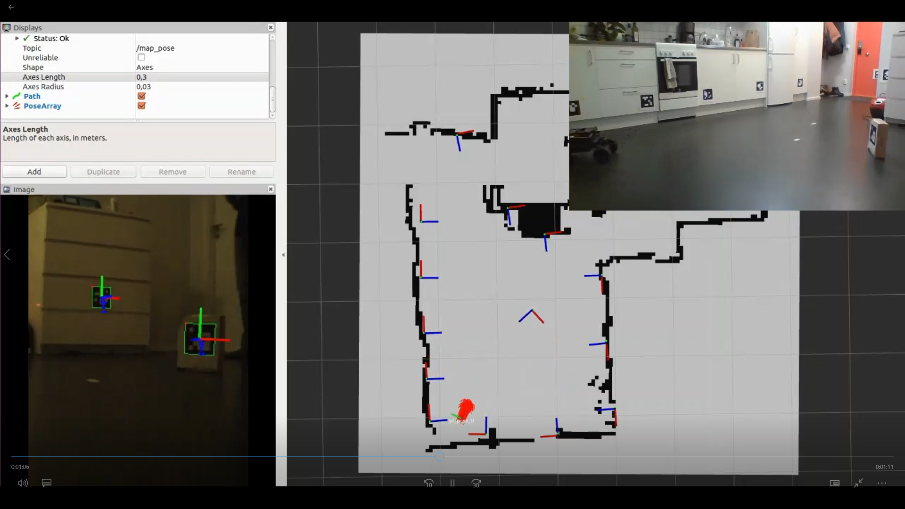
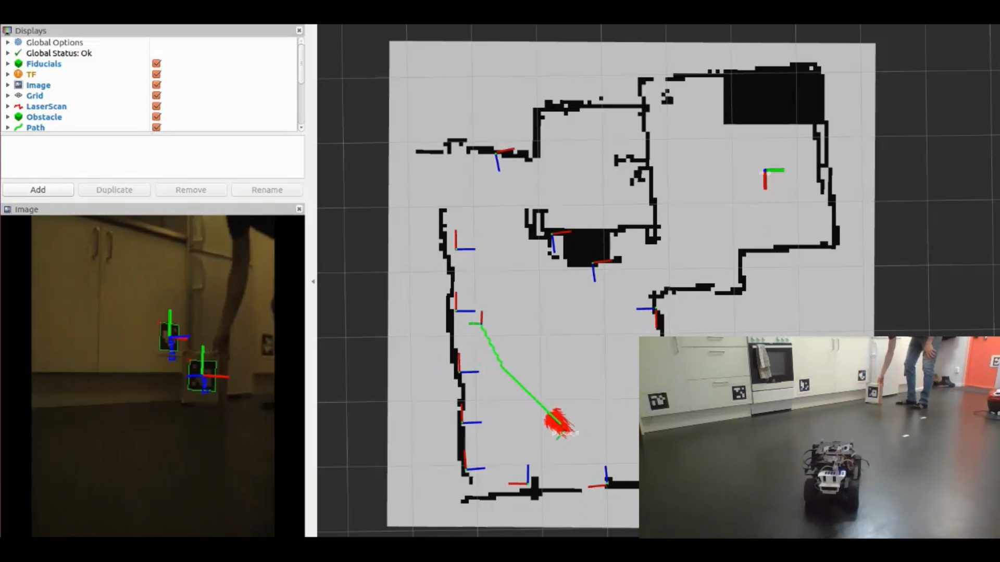

# Aruco Interface Examples

These scripts provide examples for interacting with the ArucoInterface and
ArucoSlamInterface classes found in
[svea.aruco](https://github.com/KTH-SML/svea_starter/tree/platooning_master/src/svea_core/src/svea/aruco).
They are designed to interact with the results published by
[aruco_detect](http://wiki.ros.org/aruco_detect), where aruco_detect publishes the
relative transform between the camera and detected fiducial (aruco) markers as a
[fiducial_msgs/FiducialTransformArray](http://docs.ros.org/kinetic/api/fiducial_msgs/html/msg/FiducialTransformArray.html).

The functions in the ArucoInterface class have been
designed to interact with Marker() objects. As such, most functions are called
with a Marker() object and the necessary feature of the marker (e.g. fid, pose,
etc.) is used in the function. A convenient way to interact with the functions
is to create a dictionary of Marker() objects, as seen in the example script.

These examples are not designed to detail the capabilities exhaustively, but
rather provide some basics and inspiration for how to start interacting
with ArUco (fiducial) markers.

### System Requirements
Before running the example, some additional packages may have to be installed. First,
if you don't already use a ROS package to read image data from a camera and publish
the data to the ROS network, we recommend installing the `video_streamer_opencv` package.
Then, you need to install the `aruco_detect` and `fiducial_msgs` packages. They can all
be installed by running:

```bash
sudo apt-get install ros-melodic-video-streamer-opencv ros-melodic-aruco-detect ros-melodic-fiducial-msgs
```

### Basic Usage Instructions
1. Create a launch file that includes:
    - `video_stream_opencv`
    - `tf2_ros` (e.g. similar format to [here](https://github.com/KTH-SML/svea_starter/blob/3904a29bb12b9fe2d6cd015370e4f892fa8ca229/src/svea_sensors/launch/transforms.launch#L10) to create static transform from the chosen camera frame id (set in `video_stream_opencv` arguments) to `base_link`
    - `aruco_detect`
2. Configure `video_stream_opencv` arguments for your application
3. Configure `aruco_detect` arguments so:
    - Topics `/camera/compressed` and `/camera_info` are remapped to compressed image topic and camera info topic created by `video_stream_opencv`
    - `fiducial_len` param is set to the size of the markers
    - `dictionary` param is set to the type of markers being used (e.g. DICT_5X5_1000 or DICT_4X4_100)
    - Check [aruco_detect](http://wiki.ros.org/aruco_detect) documentation for further details

**Note:** aruco_detect requires camera intrinsics are published as a [CameraInfo
Message](http://docs.ros.org/api/sensor_msgs/html/msg/CameraInfo.html). If your
camera node does not publish the intrinsics, add a node to do so (i.e. create a
yaml_to_camera_info_publisher.py)


### Example Images (from an `aruco_slam` implementation)
1. Estimating the vehicle's position based on a known marker location,
while simultaneously estimating the unknown pose of another marker.


1. Estimating a vehicle's position based on a known marker location,
while simultaneously determining a pose offset from and facing the movable marker.
The estimated vehicle pose and offset pose are used as the start pose and goal pose,
respectively, for A* path planning.


### Additional Information

Recommended website for printing ArUco markers: https://chev.me/arucogen/

Use the 5x5 markers, which correspond to dictionary 7 in aruco_detect.launch

**To Do:** Here is a list of functionality that is still needed:
- Account for different marker dimensions()
    - If a specific marker dim doesn't match the value in aruco_detect.launch
      then measurements must be adjusted

